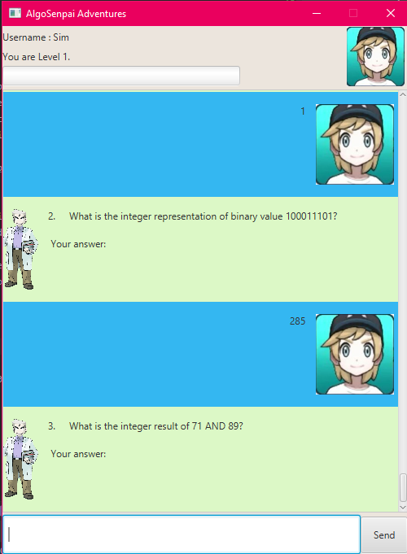
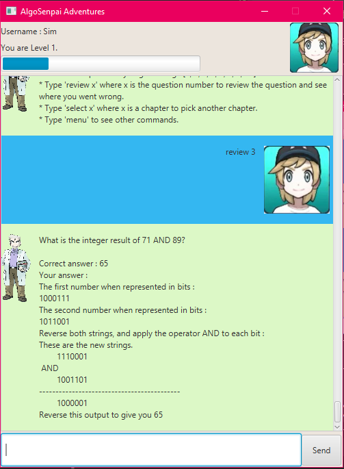
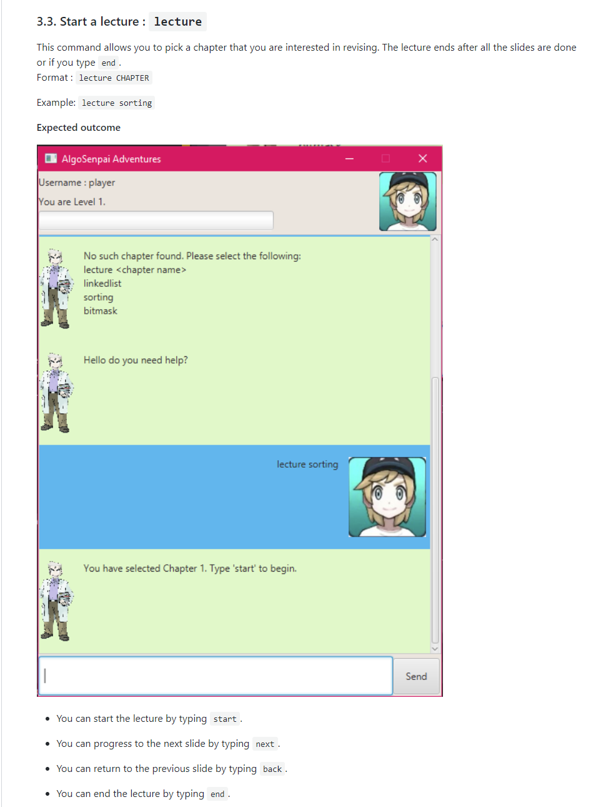
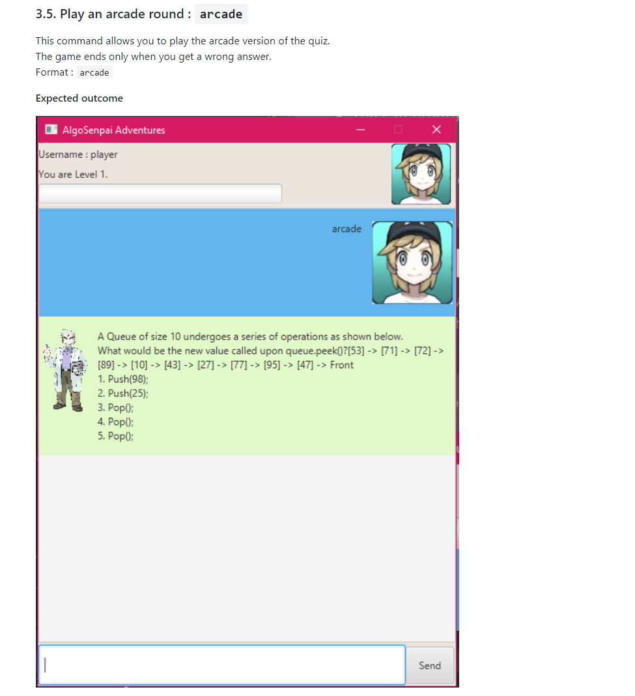
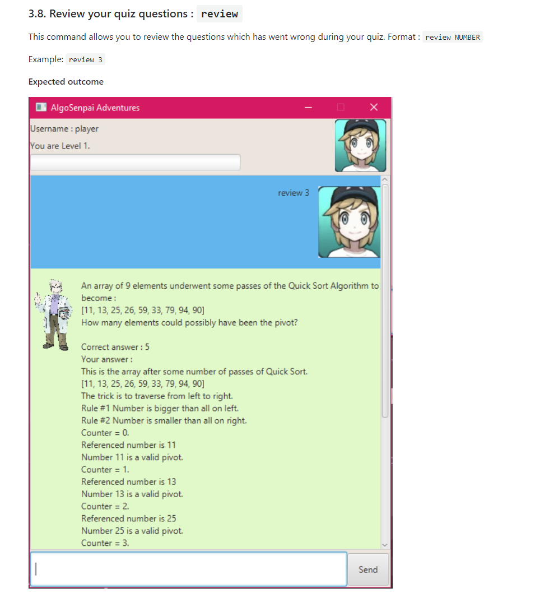

:experimental:

= Sim Yu Jie - Project Portfolio Page for AlgoSenpai Adventures

'''

== Overview :

Our team was tasked to morph a basic link:https://searchwindowsserver.techtarget.com/definition/command-line-interface-CLI[CLI] desktop application into another product
for our Software Engineering project and we adapted it to an edutainment product catered to new programming students.
We incorporated the advantages of various public resources, as well as a link:https://techterms.com/definition/gui[GUI] to develop our users’ understanding of
Data Structures and Algorithms.

The main features users can utilise to enhance their learning are : +

* Lecture

* Quiz

* Arcade

* Review

.Illustration of GUI feature.
====
image::images/Ui.png[width="300"align="center"]
====

The following sections elaborate further on my contributions, as well as the documentations I have
made in the https://github.com/AY1920S1-CS2113T-T09-3/main/blob/master/docs/UserGuide.adoc[User Guide] and https://github.com/AY1920S1-CS2113T-T09-3/main/blob/master/docs/DeveloperGuide.adoc[Developer Guide].

<<<

== Summary of Contributions :

=== Contributions to the software

My largest contribution to the project was the implementation of the critical features as well as the backend code of the
application.

==== Implementation of the critical features.

.. Lecture Mode +
* The lecture mode was a proposed feature by me in order to assist students who are not proficient at Data Structures
and Algorithms and require some assistance. This feature was inspired by https://visualgo.net[VisuAlgo] and the resources
used for the lecture slides were taken from reputable sources such as https://geeksforgeeks.org[GeeksforGeeks]. +
* Here is a reference to the
link:https://github.com/AY1920S1-CS2113T-T09-3/main/tree/master/src/main/java/com/algosenpai/app/logic/command/critical/LectureCommand.java[`LectureCommand.java`]

.. Arcade Mode +
* The Arcade mode was another proposed feature by me in order to improve students who are already confident in their skills
in Data Structures and Algorithms and want to test themselves. Questions will continuously be generated until users get a
wrong answer. By incorporating this challenging feature, users will feel motivated to improve. This feature was inspired by
games such as https://flappybird.io/[Flappy Bird], where users continuously try to beat their high score.
* Here is a reference to the
link:https://github.com/AY1920S1-CS2113T-T09-3/main/blob/master/src/main/java/com/algosenpai/app/logic/command/critical/ArcadeCommand.java[`ArcadeCommand.java`]

.Sample example from the game.
[cols="^,^"]
|===
|Lecture Command |Arcade Command

|image:images/lecturesorting.png[width="250"]
|image:images/arcade.png[width="250"]

|===

==== Backend code of the application.

.. Quiz generation +
* I was also responsible for the database behind the critical features of the application. My duty was to ensure the
correctness of the questions that were generated. The questions generated were inspired by https://visualgo.net[VisuAlgo's Quiz],
but the source code for generation was mostly written by me, with some referenced from https://geeksforgeeks.org[GeeksforGeeks].
* Each chapter contained approximately 4 different types of questions. However, the parameters supplied to each question type
are randomly generated which makes it very unlikely that students will encounter the same question.
* Here is a reference to the https://github.com/AY1920S1-CS2113T-T09-3/main/tree/master/src/main/java/com/algosenpai/app/logic/chapters[source code].

.. Review generation +
* The review command was primarily for weak users who  wish to understand what went wrong in the quiz. This was also inspired by https://visualgo.net[VisuAlgo's Quiz],
as they did not provide any help if users got the question wrong. The steps given in the review feature were
written by me.
* Each question contains a comprehensive method on how to solve it, using a step-by-step methodological approach.
* Here is a reference to one of the question's review https://github.com/AY1920S1-CS2113T-T09-3/main/blob/master/src/main/java/com/algosenpai/app/logic/chapters/chapter1/BubbleSortPassesQuestion.java[source code].

.. Menu generation +
* The menu command serves as a quick guide for new users to check on the syntax of various commands. This command was implemented
by my team member, but was improved on by me.
* Previously, each command was listed out, but I improved on it by partitioning the different commands into their separate
categories. This improved the overall user experience. I also refactored the code to read in commands from a text file to
minimise legacy issues.
* Here is a reference to the source code for https://github.com/AY1920S1-CS2113T-T09-3/main/blob/master/src/main/java/com/algosenpai/app/logic/command/utility/MenuCommand.java[`MenuCommand.java`].

.Sample example from the game.
[cols="^,^,^"]
|====
|Quiz|Review|Menu

|
|
|image:images/menuexample.png[width="200"]
|====

<<<
== Contributions to the User Guide

This section documents the contributions I made to the https://github.com/AY1920S1-CS2113T-T09-3/main/blob/master/docs/UserGuide.adoc[User Guide], which includes the guided instructions for the `lecture`, `arcade` and `review` commands, as well as the
illustrations of the expected outcomes for each command.

=== Guided Instructions
The following shows a condensation of the commands that I added into the https://github.com/AY1920S1-CS2113T-T09-3/main/blob/master/docs/UserGuide.adoc[User Guide]. To see a detailed explanation,
refer to the https://github.com/AY1920S1-CS2113T-T09-3/main/blob/master/docs/UserGuide.adoc[User Guide], or Table 3. +

==== Start a lecture : `lecture`
This command allows you to pick a chapter that you are interested in revising.
The lecture ends after all the slides are done or if you type `end`. +
Format : `lecture CHAPTER`

==== Play an arcade round : `arcade`
This command allows you to play the arcade version of the quiz. +
The game ends only when you get a wrong answer. +
Format : `arcade`

==== Review your quiz questions : `review`
This command allows you to review the questions which has went wrong during your quiz. +
Format : `review NUMBER`

.Excerpt from the https://github.com/AY1920S1-CS2113T-T09-3/main/blob/master/docs/UserGuide.adoc[User Guide].
[cols="^,^,^"]
|====
|link:https://github.com/AY1920S1-CS2113T-T09-3/main/blob/master/docs/UserGuide.adoc#start-a-lecture-lecture[Lecture]
|link:https://github.com/AY1920S1-CS2113T-T09-3/main/blob/master/docs/UserGuide.adoc#play-an-arcade-round-arcade[Arcade]
|link:https://github.com/AY1920S1-CS2113T-T09-3/main/blob/master/docs/UserGuide.adoc#review-your-quiz-questions-review[Review]

|

|

|

|====

=== Illustrations
As new users to the application, the https://github.com/AY1920S1-CS2113T-T09-3/main/blob/master/docs/UserGuide.adoc[User Guide] plays a fundamental role in acclimatising users to our game. It also contains
important information on how to set it up the first time they run it. I added in pictures of the expected outcome for each of the
steps that users will take when they start the game, as well as when they key in different commands. +

.Excerpt from User Guide.
====

. To begin, just type in `hello name gender` to put in your username and gender and press kbd:[Enter] to start your adventure.

+
image::images/Start.PNG[width="210"]
+
.  To see a list of commands you can use, just type `menu` and press `kbd:[Enter]`.

+
image::images/menu.png[width="210]
+

.  To explore the syntax of each command, simply type `menu command` and press `kbd:[Enter]`.

+
image::images/menuexample.png[width="210"]
+

====

Here is a reference to the link:https://github.com/AY1920S1-CS2113T-T09-3/main/blob/master/docs/UserGuide.adoc#start-a-lecture-lecture[User Guide]
showcasing the illustrations I have made in further detail.

<<<
== Contributions to the Developer Guide
The https://github.com/AY1920S1-CS2113T-T09-3/main/blob/master/docs/DeveloperGuide.adoc[Developer Guide] was built with the intention of assisting future programmers who wish to develop our application further.
My main contributions were under the sections of the Lecture, Quiz, and Arcade components;
as well as a feature I would be working on in v2.0 .

=== Lecture Component

.Excerpt from https://github.com/AY1920S1-CS2113T-T09-3/main/blob/master/docs/DeveloperGuide.adoc[Developer Guide].
====
[[fig-LectureSequenceDiagram]]
.Sequence Diagram of Lecture Selection
image::images/lectureslideactivitydiagram.png[width="200"]
*API* :
link:https://github.com/AY1920S1-CS2113T-T09-3/main/blob/master/src/main/java/com/algosenpai/app/logic/command/critical/ArcadeCommand.java[`ArcadeCommand.java`]

In Figure 1, the user executes the command `lecture sorting` which is passed from the UI to the Logic. Logic interprets it as a lecture and sends the command
to LectureGenerator, which instantiates all the lectures, and returns a confirmation string. The user executes `start` which gets handled by LectureCommand. LectureCommand
then returns a String containing the first slide to the user.
====

=== Quiz Component

.Excerpt from https://github.com/AY1920S1-CS2113T-T09-3/main/blob/master/docs/DeveloperGuide.adoc[Developer Guide].
====
[[fig-QuizSelectionSequenceDiagram]]
.Sequence Diagram of Quiz Selection
image::images/QuestionSelectionActivityDiagram.png[width="200"]
*API* :
link:https://github.com/AY1920S1-CS2113T-T09-3/main/blob/master/src/main/java/com/algosenpai/app/logic/chapters/QuizGenerator.java[`QuizGenerator.java`]

When the user selects a particular chapter for the quiz, the quiz generator is called.The quiz generator determines which
chapter should be called based on the user input. In this case, since the user inputs `quiz sorting`, it calls the ChapterSorting class.
The ChapterSorting Class is the class in charge of the random generation of questions related to the Chapter on Sorting.

====

=== Arcade Component

.Excerpt from https://github.com/AY1920S1-CS2113T-T09-3/main/blob/master/docs/DeveloperGuide.adoc[Developer Guide].
====
[[fig-ArcadeClassDiagram]]
.Class Diagram of ArcadeCommand
image::images/ArcadeClassdiagram.png[width="200"]
*API* :
link:https://github.com/AY1920S1-CS2113T-T09-3/main/blob/master/src/main/java/com/algosenpai/app/logic/chapters/LectureGenerator.java[`LectureGenerator.java`]

In Fig 3, the HighScore of the user is a static variable used to keep track of the number of consecutive correct answers.
In every iteration, previous question will be updated to the current question, while the current question will be a new generated question.

====

.Excerpt from https://github.com/AY1920S1-CS2113T-T09-3/main/blob/master/docs/DeveloperGuide.adoc[Developer Guide].
====
[[fig-ArcadeActivityDiagram]]
.Activity Diagram of ArcadeCommand
image::images/ArcadeActivityDiagram.png[width="200"]

In Fig 4, the user starts the arcade. The question is generated and printed on the GUI. The user inputs an answer which is received by the
Logic component. The answer is referenced to the correct answer. If the answer is correct, the highscore counter is incremented and the next
question is generated and printed. But if the answer is wrong, Arcade mode will terminate and the highscore is printed on the GUI.
====

The excerpts are the critical sections for each component that I have added into the guide that I believe will aid future
developers in understanding the key features of our game.  +

=== [Proposed] ToDo Command
.Excerpt from the https://github.com/AY1920S1-CS2113T-T09-3/main/blob/master/docs/DeveloperGuide.adoc[Developer Guide].
====

* Proposed Implementation +

This feature promotes benefits to users of all kinds. For experienced users, this command provides a way for them
to be refreshed on the concepts that they have learnt, while for inexperienced users, this encourages them to pick up
learning at a consistent pace.

* Design Consideration

** Aspect : Motivation
There must be an incentive for students who use this command. One proposal would be
to increase the amount of points awarded to users who set a todo and manages to complete it.

** Aspect : How to improve on this
Todo chapters can be set by the application on a weekly basis. The application will cycle through the different chapters
and set a todo based on the week number. In this manner, users will be encouraged to focus more on a different chapter
at every week.

** Aspect : Data Structure to support the ToDo Command
The todo task would likely be stored along with the user data in the text file. When the program starts, it does a check
on the expiry date of the task. We would be storing the todo task with a Date tagged to it, implementing Java.util.Date.
====

For a detailed explanation of the component I have worked on, you can refer to the link:https://github.com/AY1920S1-CS2113T-T09-3/main/blob/master/docs/DeveloperGuide.adoc#Design-Logic[Developer Guide].

== Other Contributions
I have included several other contributions that I felt were not as significant in the section below.
These include project management, enhancements to existing features, documentation.

=== Project management

* I was in charge on v1.3.2, which was the link:https://www.techopedia.com/definition/27809/minimum-viable-product-mvp[MVP] before v1.4 was released.
* I did updating of the issues which were outstanding on our GitHub pages.

=== Enhancement to existing features
* I refactored code in https://github.com/AY1920S1-CS2113T-T09-3/main/blob/master/src/main/java/com/algosenpai/app/logic/Logic.java[`Logic.java`] to be more developer-friendly. (https://github.com/AY1920S1-CS2113T-T09-3/main/pull/229[#229])
* I refactored code in https://github.com/AY1920S1-CS2113T-T09-3/main/blob/master/src/main/java/com/algosenpai/app/logic/command/utility/MenuCommand.java[`Menu.java`] to be more developer-friendly. (https://github.com/AY1920S1-CS2113T-T09-3/main/pull/232[#232])

=== Documentation
* Made cosmetic improvements on the User Guide.(https://github.com/AY1920S1-CS2113T-T09-3/main/pull/232[#232])

